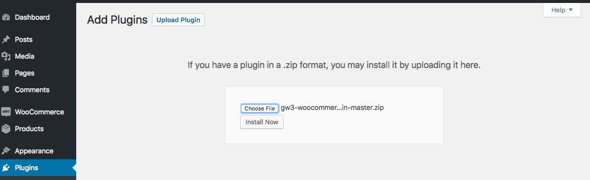
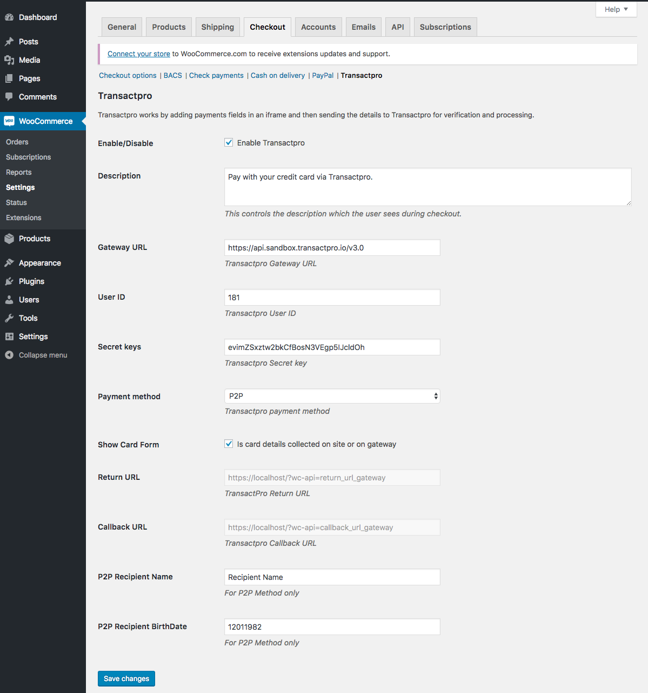
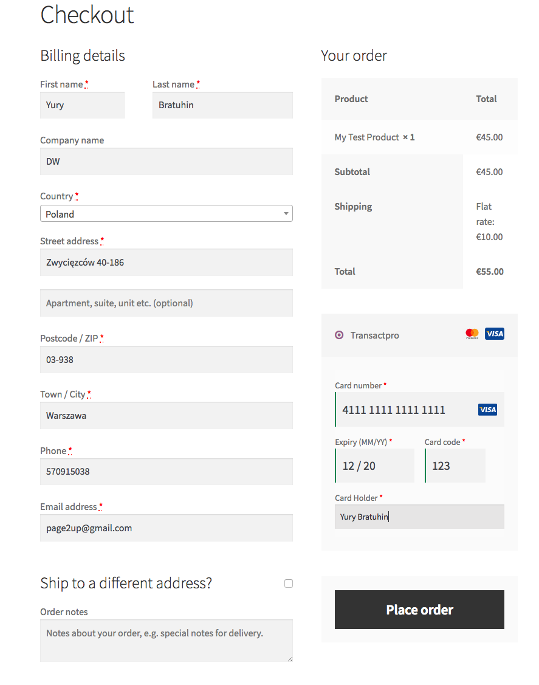
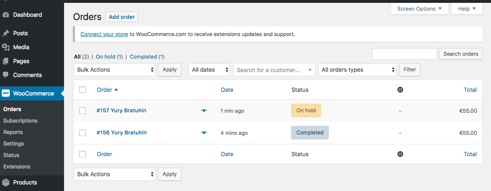
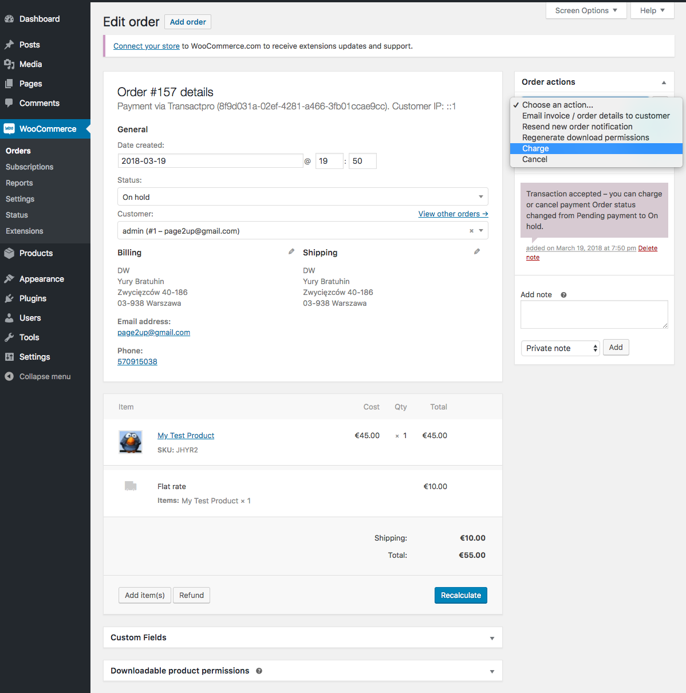
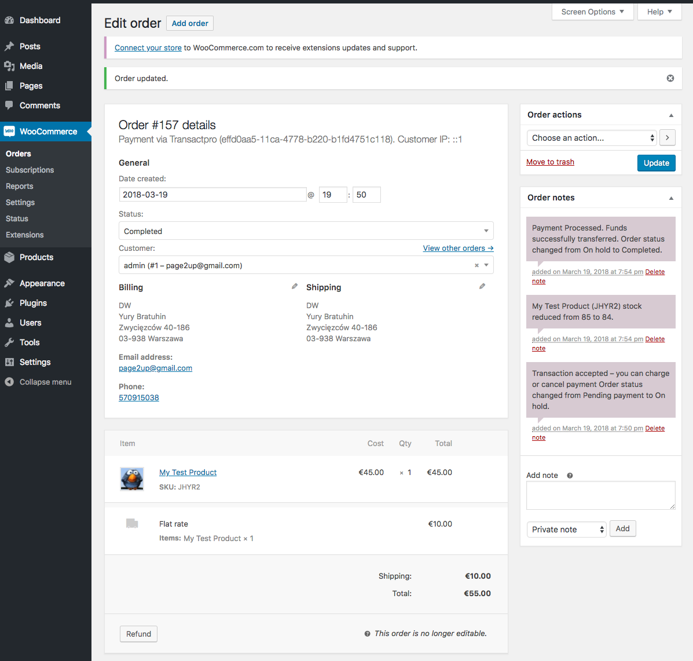
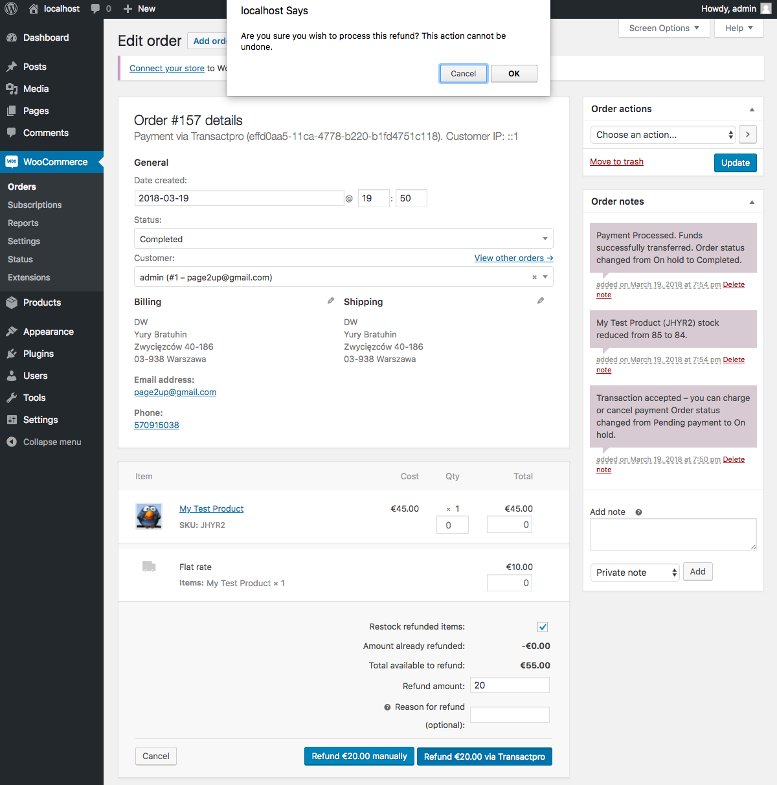

# User Documentation

## Installation
- Download latest module version from [distributions](https://github.com/TransactPRO/gw3-woocommerce-plugin/archive/master.zip)
- Install downloaded plugin via standard WP installation plugin form and Enable it.   

## Initial configuration

-  Configure plugin in WooCommerce admin (`WooCommerce > Settings > Checkout > TransactPro`) 

### Payment settings
- `Enabled`: Yes/No - Enables or disables Transact Pro module
- `Description`: Text shown on checkout 
- `Gateway URL`: Default (https://api.sandbox.transactpro.io/v3.0) or enter the information received from Transact Pro support team 
- `User ID`: - Specify your numeric Account ID received from the Transact Pro support team, the specific Account ID is related the way payments being processed
- `Secret key`: - Specify your Secret Key received from the Transact Pro support team
- `Payment Method`: Choose payment method you want to use (`SMS` is most common used)
  Supported methods are:
    - SMS: Customer will charged immediately, transaction can be reverted manually
    - DMS: Funds will be reserved, merchant can charge them or cancel manually
    - Credit: Funds will be transferred to merchant's credit card
    - P2P: Funds will be transferred to merchant's credit card using P2P method
- `Show Card Form`: Choose Merchant Side (credit card details will be entered on Checkout page) or Payment gateway side (client will be redirected to payment gateway page to enter credit card details). Note: Payment Information Capture depends from Account ID, you need to set corresponded Account ID value for correct work. For example, you have following Account ID values: 
  For example, you have following Account ID values:
    - 100: CARD DETAILS COLLECTED ON GW SIDE_3D_V     - That means Security 3D transactions, customer will be redirected to payment gateway to enter credit card information, you need to set `Payment Action` as `Authorize only` 
    - 101: CARD DETAILS COLLECTED ON GW SIDE_NON 3D_V - That means non-3D transactions, customer will be redirected to payment gateway to enter credit card information, you need to set `Payment Action` as `Authorize only` 
    - 200: CARD DETAILS COLLECTED ON API_3D_V         - That means Security 3D transactions, customer will enter credit card information directly on Checkout page, you need to set `Payment Action` as `Authorize only` 
    - 201: CARD DETAILS COLLECTED ON API_NON3D_V      - That means non-3D transactions, customer will enter credit card information directly on Checkout page, if your `Payment Method = DMS` you need to set `Payment Action` as `Authorize only` otherwise set `Payment Action` as `Authorize and Capture`
- `Return URL`: - You can not change that, this information is needed for Transact Pro support team to properly configure your account
- `Callback URL`: - You can not change that, this information is needed for Transact Pro support team to properly configure your account
- `P2P Recipient Name`: - Specify your full name (First Name Last Name)
- `P2P Recipient BirthDate`: - Specify your birth date (dd.mm.yyyy)

### Global settings

The Transact Pro gateway currently operates with Euro only! Please, configure your WooCommerce instance to operate Euro by default (`WooCommerce > Settings > General`): 

### Subscriptions

- Please read WooCommerce Subscriptions [manual](https://woocommerce.com/products/woocommerce-subscriptions/)

## Transaction handling

### Executing transaction

Choose Payment Method as `TransactPro` and fill card details (depends from the `Payment Method` and `Show Credit Card Form?` settings)

- directly on Checkout page: 

- or Payment Gateway page (After Place Order):

### Merchant

#### Orders

##### Order details

Click on the the corresponded order

##### Accept or Deny payment

If you are using DMS `Payment method` you can Accept or Deny payment for order.

All changes will be displayed in right "Order notes" section .

##### Refund order

You can refund orders (after successful payment)

